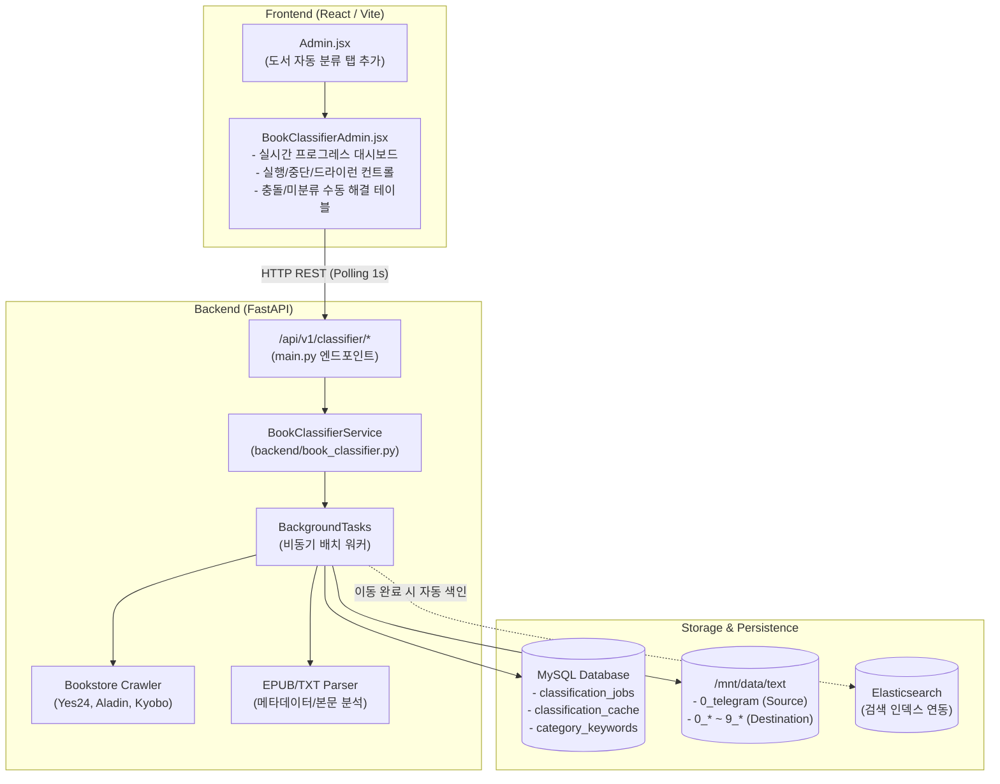

# tm_dev 도서 자동 분류 시스템(Book Classifier) 통합 설계서

> **문서 버전**: 1.0.0
> **대상 프로젝트**: `~/workspace/tm_dev` (TextMgmt)
> **작성 목적**: 다른 AI 에이전트 및 개발자가 본 문서를 바탕으로 FastAPI 백엔드 및 React 프론트엔드에 결정론적(Deterministic) 도서 자동 분류 파이프라인을 즉시 구현할 수 있도록 상세 아키텍처, 데이터 모델, API 명세, 컴포넌트 설계 및 단계별 구현 가이드를 제공합니다.

---

## 1. 개요 및 설계 원칙

### 1.1 현재 작업의 성격 (Deterministic Python vs AI)
* **현재 엔진의 실체**: 본 분류 엔진은 LLM이나 외부 생성형 AI 모델을 호출하지 않는 **100% 결정론적(Deterministic) 순수 파이썬 알고리즘**입니다.
* **핵심 메커니즘**:
  1. 정규표현식 기반 파일명 정제 및 부모 디렉토리 메타데이터(저자/시리즈명) 지능형 결합
  2. 3대 온라인 서점(Yes24, 알라딘, 교보문고) 웹 스크레이핑 및 표준 카테고리 추출
  3. bi-gram Dice coefficient 문자열 유사도($\text{Sim} \ge 0.35$)를 통한 단일 서점 추천도서 오매칭 차단
  4. 3개 서점 교차 검증 및 2/3 다수결(Majority Vote) 투표 판정
  5. 장르소설군(`3_*`) 내부 충돌 시 도메인 키워드 빈도 휴리스틱 해결
  6. 서점 미검색 도서 대상 EPUB `.opf` 메타데이터 및 TXT 상단 본문 키워드 스코어링
  7. 파일 이동(`shutil.move`), 대상지 중복본 정리(`unlink`), 비어 있는 부모 폴더 재귀 청소(`rmdir`)
* **목표**: 위 로직을 `tm_dev`의 기존 아키텍처(FastAPI, BackgroundTasks, MySQL `CategoryMapping`, React Admin Dashboard)에 네이티브 컴포넌트로 완벽하게 이식합니다.

---

## 2. 시스템 아키텍처 다이어그램



---

## 3. 백엔드(Backend) 상세 설계

### 3.1 파일 및 모듈 배치 구조
```text
backend/
├── bookstore.py            # [기존 확장] KyoboBookstore 클래스 추가
├── category_mapping.py     # [기존 활용] MySQL 기반 카테고리 매핑 연동
├── book_classifier.py      # [신규 추가] 분류 엔진, 파서, 판정기, 배치 작업자
├── main.py                 # [기존 확장] /api/v1/classifier/* 엔드포인트 등록
└── book_manager.py         # [기존 연동] 파일 이동 후 ES 인덱싱 트리거
```

### 3.2 서점 크롤러 보완 (`backend/bookstore.py`)
기존 `backend/bookstore.py`에 누락되어 있는 **`KyoboBookstore`**를 `AbstractBookstore` 서브클래스로 추가합니다.

* **URL 구조**:
  - 통합 검색: `https://search.kyobobook.co.kr/search?keyword={keyword}`
  - eBook 전용: `https://ebook-product.kyobobook.co.kr/dig/epd/ebook/{id}`
* **카테고리 경로 파싱**:
  - 상세 페이지의 브레드크럼(`ol.breadcrumb_list > li` 또는 `.prod_info_box`)에서 `소설 > 한국소설`, `장르소설 > 판타지` 추출.
* **레이트 리밋(Rate Limit)**: 서점 요청 간격 기본 1.2초 유지.

---

### 3.3 분류 핵심 엔진 (`backend/book_classifier.py`)
순수 함수와 서비스 클래스로 구성합니다.

#### 주요 함수/클래스 명세:
1. **`get_effective_filename(fpath: Path, target_dir: Path) -> str`**:
   - `01권.txt` 같은 단순 권수 파일인 경우 부모 폴더명(작품명)을 결합.
   - 부모 폴더에 `[저자]` 태그가 있고 파일명에 없으면 부모의 저자 태그를 파일명 앞에 결합.
2. **`clean_filename_to_author_title(filename: str) -> tuple[str, str, str]`**:
   - URL 인코딩(`%5B` 등) 디코딩, 검열 우회용 마침표(`신.화.급` -> `신화급`), `(019)`, `完` 등의 노이즈 정제 후 `(raw_author, raw_title, search_title)` 반환.
3. **`extract_explicit_genre(filename: str) -> Optional[str]`**:
   - `[로판]`, `(무협)`, `[판타지]`, `[BL]` 등 파일명에 선언된 장르를 최우선 추출.
4. **`title_similarity(t1: str, t2: str) -> float` & `is_single_match_valid(...) -> bool`**:
   - bi-gram Dice coefficient 기반 제목 유사도($\ge 0.35$) 검증.
5. **`resolve_genre_conflict(cats: list[str], fname: str, text_sample: str) -> Optional[str]`**:
   - 무협 vs 판타지, 로판 vs 판타지 등 `3_*` 계열 서점 간 사소한 충돌을 키워드로 자동 해소.
6. **`inspect_epub_metadata(fpath: Path)` & `inspect_txt_content(fpath: Path)`**:
   - 서점 미검색 도서의 본문 첫 60줄 및 EPUB OPF 메타데이터(`dc:subject`, `dc:description`) 분석.
7. **`BookClassifierService` (메인 서비스 클래스)**:
   - `evaluate_file(fpath: Path) -> ClassificationDecision`: 단일 파일 분석
   - `process_file(fpath: Path, auto_move: bool, clean_existing: bool) -> ProcessResult`: 이동 및 정리
   - `run_batch_job(job_id: str, options: BatchOptions)`: 백그라운드 태스크 실행기

---

### 3.4 데이터베이스 스키마 (`MySQL`)

기존 `category_mapping.py`의 MySQL 구조를 확장하여 작업 상태와 캐시를 DB 테이블로 영구 관리합니다.

```sql
-- 1. 분류 배치 작업 상태 관리 테이블
CREATE TABLE IF NOT EXISTS classification_jobs (
    job_id VARCHAR(64) PRIMARY KEY,
    source_dir VARCHAR(512) NOT NULL,
    status VARCHAR(20) NOT NULL DEFAULT 'running', -- 'running', 'paused', 'completed', 'failed', 'stopped'
    total_files INT NOT NULL DEFAULT 0,
    processed_files INT NOT NULL DEFAULT 0,
    moved_count INT NOT NULL DEFAULT 0,
    cleaned_count INT NOT NULL DEFAULT 0,
    conflict_count INT NOT NULL DEFAULT 0,
    single_match_count INT NOT NULL DEFAULT 0,
    not_found_count INT NOT NULL DEFAULT 0,
    current_file VARCHAR(512) NULL,
    options_json JSON NULL,
    started_at TIMESTAMP DEFAULT CURRENT_TIMESTAMP,
    updated_at TIMESTAMP DEFAULT CURRENT_TIMESTAMP ON UPDATE CURRENT_TIMESTAMP,
    completed_at TIMESTAMP NULL,
    error_message TEXT NULL,
    INDEX idx_status (status)
) ENGINE=InnoDB DEFAULT CHARSET=utf8mb4 COLLATE=utf8mb4_unicode_ci;

-- 2. 도서별 서점 쿼리 및 분류 결과 캐시 테이블
CREATE TABLE IF NOT EXISTS classification_cache (
    file_rel_path VARCHAR(512) PRIMARY KEY,
    filename VARCHAR(255) NOT NULL,
    raw_author VARCHAR(255) NULL,
    raw_title VARCHAR(255) NULL,
    search_title VARCHAR(255) NULL,
    yes24_json JSON NULL,
    aladin_json JSON NULL,
    kyobo_json JSON NULL,
    decision_type VARCHAR(50) NULL, -- 'explicit_genre', 'majority', 'conflict_resolved', 'single_match', 'content_metadata'
    target_category VARCHAR(100) NULL,
    status VARCHAR(50) NOT NULL,    -- 'moved', 'conflict', 'single_match', 'not_found', 'already_exists_cleaned'
    updated_at TIMESTAMP DEFAULT CURRENT_TIMESTAMP ON UPDATE CURRENT_TIMESTAMP,
    INDEX idx_status (status),
    INDEX idx_target_category (target_category)
) ENGINE=InnoDB DEFAULT CHARSET=utf8mb4 COLLATE=utf8mb4_unicode_ci;
```

---

### 3.5 REST API 명세 (`backend/main.py`)

모든 엔드포인트는 `admin_dep` (`require_admin`) 권한으로 보호됩니다.

| Method | Endpoint | Description | Request Body / Query | Response Example |
| :--- | :--- | :--- | :--- | :--- |
| `POST` | `/api/v1/classifier/start` | 분류 배치 작업 시작 | `{ "source_dir": "/mnt/data/text/0_telegram", "recursive": true, "clean_existing": true, "dry_run": false, "delay": 1.2 }` | `{ "job_id": "job_20260904_01", "status": "started" }` |
| `GET` | `/api/v1/classifier/status` | 현재/최근 작업 진행률 조회 | `?job_id=optional` | `{ "job_id": "...", "status": "running", "progress": 15.4, "total": 82019, "processed": 12630, "moved": 7820, "current_file": "초인동맹 05권.txt" }` |
| `POST` | `/api/v1/classifier/stop` | 실행 중인 작업 중단 | `{ "job_id": "..." }` | `{ "status": "stopped" }` |
| `GET` | `/api/v1/classifier/unresolved` | 미분류 도서 목록 페이징 | `?status=conflict&page=1&size=20` | `{ "items": [ ... ], "total": 3460, "page": 1 }` |
| `POST` | `/api/v1/classifier/resolve-manual` | 충돌/단일 매칭 수동 카테고리 확정 이동 | `{ "file_rel_path": "path/file.epub", "target_category": "3_판타지" }` | `{ "success": true, "moved_to": "3_판타지/file.epub" }` |
| `POST` | `/api/v1/classifier/re-evaluate` | 캐시 기반 무지연 초고속 재평가 | `{ "source_dir": "/mnt/data/text/0_telegram" }` | `{ "job_id": "job_reeval_01", "status": "started" }` |

---

## 4. 프론트엔드(Frontend) 컴포넌트 설계

### 4.1 컴포넌트 구조
```text
frontend/src/
├── Admin.jsx                  # [수정] "도서 자동 분류 관리" 탭 추가
└── BookClassifierAdmin.jsx    # [신규] 대시보드, 제어 패널, 미해결 목록 테이블
```

### 4.2 `BookClassifierAdmin.jsx` 핵심 UI 구성
1. **헤더 상태 대시보드 카드**:
   - 총 도서 수, 처리 완료 수, 자동 이동 수, 중복 정리 수, 충돌/미해결 수를 React-Bootstrap `Card`와 `Badge`로 시각화.
   - 전체 진행률 `ProgressBar` (애니메이션 지원, % 및 남은 예상 시간 표시).
   - 현재 처리 중인 도서명 실시간 표시.
2. **제어 바 (Control Toolbar)**:
   - **대상 디렉토리 입력**: 기본 `/mnt/data/text/0_telegram`
   - **옵션 체크박스**: `하위 디렉토리 재귀 탐색(recursive)`, `대상지 중복본 정리(clean_existing)`, `단일 서점 신뢰(trust_single)`, `시뮬레이션(dry_run)`
   - **액션 버튼**:
     - `작업 시작 (Start)` / `작업 중단 (Stop)`
     - `초고속 재평가 실행 (Fast Re-evaluate)`
3. **미해결 도서 수동 검토 & 원클릭 이동 테이블 (Unresolved Resolution Table)**:
   - 탭 필터: `충돌(Conflict)`, `단일 매칭(Single Match)`, `미검색(Not Found)`
   - 테이블 칼럼:
     - 도서 파일명 및 원본 경로
     - 추출된 검색어 (저자, 제목)
     - 서점별 결과 비교 배지 (예: Yes24: `3_무협`, Aladin: `3_판타지`, Kyobo: `3_무협`)
     - **원클릭 이동 드롭다운/버튼**: 관리자가 올바른 카테고리를 클릭하면 즉시 해당 폴더로 이동 처리.

---

## 5. 단계별 구현 로드맵 (AI 에이전트 지침)

다른 AI 에이전트가 본 작업을 수행할 때 반드시 다음 순서로 구현하고 단계별 검증을 수행해야 합니다.

### [1단계] 백엔드 기반 모듈 구현
1. `backend/bookstore.py`에 `KyoboBookstore` 클래스 구현 및 단위 테스트.
2. `backend/book_classifier.py` 작성 (파일명 파서, 유사도 계산기, 다수결 판정기, 메타데이터 추출기 이식).
3. `tests/test_book_classifier.py` 작성 후 `pytest tests/test_book_classifier.py` 검증 통과.

### [2단계] DB 테이블 마이그레이션 & API 연동
1. `backend/category_mapping.py`에 `classification_jobs`, `classification_cache` 테이블 생성 DDL 추가.
2. `backend/main.py`에 `/api/v1/classifier/*` 라우터 등록 및 `BackgroundTasks` 비동기 워커 연결.
3. `pytest tests/test_classifier_api.py` 작성 및 API 동작 검증.

### [3단계] 프론트엔드 UI 개발
1. `frontend/src/BookClassifierAdmin.jsx` 신규 작성 (대시보드 + 제어판 + 수동 매핑 테이블).
2. `frontend/src/Admin.jsx`에 새 탭 등록:
   ```jsx
   const CLASSIFIER_TAB = "book-classifier";
   ...
   <Tab eventKey={CLASSIFIER_TAB} title="도서 자동 분류 관리">
     {activeTab === CLASSIFIER_TAB && <BookClassifierAdmin />}
   </Tab>
   ```
3. `cd frontend && npm test` 통과 확인.

### [4단계] E2E 통합 검증
1. 로컬 환경에서 소규모 디렉토리(10~20권) 대상 Dry-Run 테스트 수행.
2. 실제 이동 및 중복 정리, 빈 폴더 삭제 동작 확인.
3. 진행률 폴링 및 수동 해결 버튼 동작 검증.

---

## 6. 예외 처리 및 안정성 보장 (Guardrails)

1. **파일 I/O 원자성 및 안전성**:
   - 파일 이동 시 대상 폴더에 동일 이름의 파일이 존재할 경우, 원본 파일의 내용이 손상되지 않도록 먼저 파일 크기/해시를 비교하거나 `--clean-existing` 정책에 따라 안전하게 처리.
2. **외부 서점 레이트 리밋 준수**:
   - 서점 크롤링 시 반드시 최소 1.2초(`delay=1.2`) 이상의 간격을 강제하여 IP 차단 방지.
3. **서버 재시작 시 복구력**:
   - 백그라운드 작업 도중 서버가 재시작되어도 MySQL `classification_jobs` 및 `classification_cache`에 마지막 상태가 영구 저장되므로, 중복 크롤링 없이 미처리 파일부터 즉시 재개 가능.
4. **빈 디렉토리 삭제 안전장치**:
   - `clean_empty_parent_dirs`는 오직 루트 타깃 디렉토리 하위의 완전 비어 있는 디렉토리(`len(items) == 0`)만 `rmdir`로 제거하며, 다른 파일이 남아 있는 디렉토리는 절대 강제 삭제하지 않음.
